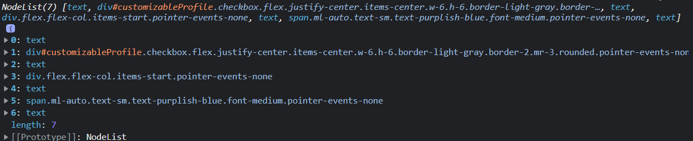

# Frontend Mentor - Multi-step form solution

This is a solution to the [Multi-step form challenge on Frontend Mentor](https://www.frontendmentor.io/challenges/multistep-form-YVAnSdqQBJ). Frontend Mentor challenges help you improve your coding skills by building realistic projects.

## 목차

- [개요](#overview)
  - [챌린지 안내](#the-challenge)
  - [구현 예시(스크린샷 또는 영상)](#screenshot)
  - [링크](#links)
- [작업 사항](#my-process)
  - [기술 스택](#built-with)
  - [학습 및 문제 해결 사항](#what-i-learned)
  - [추가 개발 희망 사항](#continued-development)
  - [참고 자료 링크](#useful-resources)
- [제작자](#author)
- [후기](#acknowledgments)

## 개요

### 챌린지 안내

제작자는 아래의 내용을 반드시 구현해야 한다.

- 각 스텝의 순서를 완성할 것
- 마지막 스텝에 유저의 선택선택에 따른 결과를 요약해 보여주고, 그들의 요청을 확인해 줄 것
- 각 유저가 사용하는 기기의 스크린에 맞는 최적화된 레이아웃을 보여줄 것
- 페이지마다 상호 작용이 가능한 모든 요소는 hover나 foucs 등을 적용시켜줄 것

### 구현 예시 (스크린샷 또는 영상)

**데스크탑 버전**


**모바일 버전**


### 링크

- [챌린지 업로드 사이트](https://www.frontendmentor.io/solutions/multistep-form--LdhdRoEt-)
- [구현된 챌린지 사이트](https://drunkenneoguri.github.io/multistepform-challenge/)

## 작업 사항

### 기술 스택

- HTML5
- CSS3
- JavaScript
- [Tailwind CSS](https://tailwindcss.com/) - Utility-first 기반의 CSS 프레임워크

### 학습 및 문제 해결 사항

**1️⃣ 배열로 변환시켜주는 만들어주는 Array.from()**

`Array.from()` 메소드는 배열처럼 나열할 수 있는 객체나 문자열과 같은 ‘유사 배열(Array-like) 형태’를 가진 값들을 배열로 변환시켜주는 메소드이다.

`Array.from()` 메소드를 사용할 수 있는 사례는 아래와 같은 것들이 있다.

- Iterable Object, 즉 반복 가능한 객체
- 문자열
- DOM 요소들이 나열된 HTMLCollection
- 배열와 유사한(Array-like) 객체
  - 예시: `{0: “a”, 1: “b”, 2: “c”, length: 3}`

`Array.from()` 메소드는 아래의 형태를 가진다.

```jsx
Array.from(**유사 배열**, Array.map(함수), thisArg)
// Array.from(유사 배열).map(함수, thisArg) 와 동일하다.
```

- **유사 배열**
  - **필수 요소**이다.
    배열과 유사한 형태를 가진 값이 있어야, 해당 값을 기준으로 배열을 만들어낼 수 있다.
- `Array.map(함수)`
  - 부가 요소이며, 배열에 쓰이는 `map()` 메소드 안의 함수를 가리킨다.
  - 즉, `map()` 메소드를 호출하지 않고도 두 번째 인자에 `map()` 메소드 안에 들어갈 함수를 배치해 `map()` 메소드를 바로 적용할 수 있다.
- `thisArg`
  - 부가 요소이다.
    앞의 `map()` 메소드 함수에서 받아올 `this`의 값을 배치한다.
    없으면 `this`의 값은 `map()` 메소드를 적용하는 배열 자신이 된다.

해당 챌린지 구현할 때 당시, step3 페이지가 불러와지면 이미 유저가 선택한 혹은 선택하지 않은 옵션 리스트 영역들의 차이가 나도록 불러오게 할 필요가 있었다.


DOM 객체를 통해 `getElementsByClassName()`메소드를 이용해 해당되는 영역을 불러왔지만, `HTMLCollection`이라는 유사 배열인 객체가 받아와졌다.


- `HTMLCollection`
  - 간단히 말해 HTML에 있는 요소들을 배열로 모아놓은 객체이다.
  - 배열처럼 보이지만, `typeof` 연산자와 `Array.isArray()` 메소드를 이용해 확인하면 배열이 아님을 확인할 수 있다.

이러다보니, 각 요소들마다 유저가 이미 선택한 건지, 아닌건지를 순서대로 조건을 체크해 표시를 다르게 하기 위해 `forEach()` 메소드를 관리하고 싶다고 판단했고, 이를 위해 유사 배열인 객체를 배열로 받아올 필요가 있었다.

따라서 `Array.from()`을 통해 유사 배열 객체인 `HTMLCollection`을 배열로 받아와 아래와 같이 `forEach()` 메소드를 사용하여 영역별 상태를 변경하도록 구현했다.

```jsx
const checkboxGroup = document.getElementsByClassName("checkbox");
// checkbox class가 들어간 요소들을 리스트화

// Array.from을 통해 리스트화된 요소들을 배열로 변경하고, forEach 메소드를 사용해
// 각각의 요소별로 상태를 체크하여 적용하도록 함.
**Array.from(checkboxGroup)**.forEach((element) => {
  if (selectState.period === "Yearly") {
    const costSpan = element.parentNode.childNodes[5];
    costSpan.innerText =
      element.id === "onlineService" ? "+$10/yr" : "+$20/yr";
  }

  if (selectState.addon.indexOf(element.id) !== -1) {
    element.parentNode.classList.add("border-purplish-blue", "bg-magnolia");
    element.classList.add("bg-purplish-blue", "border-purplish-blue");
  } else {
    element.parentNode.classList.remove(
      "border-purplish-blue",
      "bg-magnolia"
    );
    element.classList.remove("bg-purplish-blue", "border-purplish-blue");
  }
});
```

위의 방식을 이용해 배열 속 DOM 요소들에 유저가 선택한 옵션인지를 확인하여 선택했다면 선택한 상태로, 아니라면 선택한 상태를 제거했다.

이처럼 `Array.from()`을 이용하면 유사 배열인 값을 배열로 변환해줄 뿐만 아니라, 배열이 됐기 때문에 배열의 메소드들을 바로 활용할 수도 있다.

2️⃣ **JavaScript를 이용해 부모, 자식, 형제의 노드를 받아오는 방법**

여기 노트 트리 그림을 보자.


출저: [https://www.lambdatest.com/blog/testcafe-selectors/](https://www.lambdatest.com/blog/testcafe-selectors/)

`div`라는 요소를 보면 `div` 안엔 `img`, `h1`, `p`, `div`라는 요소가 있다.
그리고 `div`와 동일 선상에 `script`라는 요소가 존재하며 `div`와 `script`는 모두 `body` 요소에 포함되어 있다.

이를 HTML로 표현하면 아래와 같이 그려진다.

```html
<body>
	<**div**>
		<h1></h1>
		<p></p>
		
		<div></div>
	</**div**>
	<script></script>
</body>
```

그리고 중심이 되는 div 요소와 다른 요소들과의 관계를 정리하면 아래와 같이 정리할 수 있다.

- 부모 노드: `body`
- 형제 노드: `script`
- 자식 노드: `h1`, `p`, `img`, `div`

내용을 정리하면서 요소와 노드가 번갈아 나오는 데에 혼란이 있을 수 있으므로 잠시 짚고 가자.


출저: [https://dionysus2074.tistory.com/137](https://dionysus2074.tistory.com/137)

- 노드(Node)란, **쉽게 말해 HTML의 문서를 구성하는 단위**이다.
  이 노드에는 텍스트, 요소, 속성, 주석 등이 포함되어 있는데 우리가 흔히 말하는 `div`와 `img`, `h1` 같은 요소는 바로 이 요소 노드(Element Node)를 가리킨다.
- 그 밖에도 요소 노드 속에 출력되는 텍스트 내용은 텍스트 노드(Text Node), HTML 안에 작업자만 볼 수 있게 주석을 달아놓는 내용은 주석 노드(Comment Node), 요소 속에 쓰이는 onclick이나 style, id와 같은 속성들은 속성 노드(Attribute Node)로 불리고 있다.

위 1️⃣에서 Array.from()으로 받아온 배열의 요소들과 관련하여 유저가 선택한 옵션인지 아닌지에 따라 스타일에 변화를 주고 싶었다.

그러나 checkbox class가 포함된 요소는 `button` 요소 안에 있는 `div`이며, 유저의 선택 여부에 따라 체크박스 표시에 변화와 생기는 것 외에도 체크박스를 포함한 버튼의 테두리의 색상을 변경할 필요가 있었다.

```html
<button
  class="flex flex-row items-center border-light-gray border-2 rounded-md my-2 p-3 w-full xsm:w-110 xsm:my-4 xsm:p-4"
  onclick="selectAddOnOption(event)">
  <div
    id="largerStorage"
    class="**checkbox** flex justify-center items-center w-6 h-6 border-light-gray border-2 mr-3 rounded pointer-events-none xsm:mr-4">
    
  </div>
  <div class="flex flex-col items-start pointer-events-none">
    <label
      class="block text-marine-blue text-sm font-medium pointer-events-none xsm:text-base "
      >Larger storage</label
    >
    <span class="block text-cool-gray text-xs pointer-events-none xsm:text-sm"
      >Extra 1TB of cloud save</span
    >
  </div>
  <span
    class="ml-auto text-sm text-purplish-blue font-medium pointer-events-none"
    >+$2/mo</span
  >
</button>
```

따라서 체크박스를 담당하는, checkbox class가 포함된 `div`의 부모인 `button`을 찾아 두 요소의 class에 변화를 주기 위해 아래와 같이 코드를 작성했다.

```
const checkboxGroup = document.getElementsByClassName("checkbox");
// checkbox class가 들어간 요소들을 리스트화

// Array.from을 통해 리스트화된 요소들을 배열로 변경하고, forEach 메소드를 사용해
// 각각의 요소별로 상태를 체크하여 적용하도록 함.
  Array.from(checkboxGroup).forEach((element) => {
    if (selectState.addon.indexOf(element.id) !== -1) {
      **element.parentNode**.classList.add("border-purplish-blue", "bg-magnolia");
			// 요소의 .parentNode 속성을 불러오면 해당 요소의 부모 노드를 받아올 수 있다.
			// 여기서 element는 checkbox class를 포함하고 있는 div이므로,
			// element.parentNode가 받아오는 요소는 div의 부모인 button이다.
      element.classList.add("bg-purplish-blue", "border-purplish-blue");
    } else {
      element.parentNode.classList.remove("border-purplish-blue", "bg-magnolia");
      element.classList.remove("bg-purplish-blue", "border-purplish-blue");
    }
  });
```

이처럼 요소의 부모 노드를 받아오고 싶다면 `.parentNode` 속성을 활용하면 된다.

한편, 이 내용 외에도 유저가 연 구독인지, 월 구독인지에 따라서 페이지에 있는 금액 표시가 연 단위, 월 단위로 변경되는 내용을 구현할 필요가 있었다.

동일 선상에 있는 형제 노드를 받아오고 싶지만, 형제 노드를 지원해주는 것은 해당 요소의 직전 앞과 직전 뒤이므로 가격 값을 출력하는 요소인 span을 받아올 수 없어서 부모 노드인 button로 거슬러 올라가 button의 자식 노드 중 span을 받아오도록 조건을 추가했다.

```
const checkboxGroup = document.getElementsByClassName("checkbox");
// checkbox class가 들어간 요소들을 리스트화

// Array.from을 통해 리스트화된 요소들을 배열로 변경하고, forEach 메소드를 사용해
// 각각의 요소별로 상태를 체크하여 적용하도록 함.
  Array.from(checkboxGroup).forEach((element) => {
		if (selectState.period === "Yearly") {
			// 현재 유저가 구독한다는 조건이 '연 구독'이라면
      const costSpan = element.parentNode.childNodes[5];
			// button의 자식 요소인 span을 찾아서 해당 노드에 출력되는 가격이 조건에 따라
			// 바뀌도록 적용함.
      costSpan.innerText =
        element.id === "onlineService" ? "+$10/yr" : "+$20/yr";
    }

    if (selectState.addon.indexOf(element.id) !== -1) {
      **element.parentNode**.classList.add("border-purplish-blue", "bg-magnolia");
      element.classList.add("bg-purplish-blue", "border-purplish-blue");
    } else {
      element.parentNode.classList.remove("border-purplish-blue", "bg-magnolia");
      element.classList.remove("bg-purplish-blue", "border-purplish-blue");
    }
  });
```

앞서 `element.parentNode`가 받아오는 노드는 `div`의 부모인 `button`라고 설명했다.

이 `button`의 자식 노드 중 가격 정보를 가진 `span`의 내용을 바꾸고 싶었으므로 자식 노드를 받아오는 속성인 `.childNodes`를 활용해 자식 노드를 변수 `costSpan`에 저장했다.

참고로 부모 노드에 `.childNodes`를 활용하면 아래와 같이 콘솔창에서 자식 노드들을 볼 수 있다.



사이사이에 보이는 텍스트 노드는 `/n`, 줄 바꿈 값이 적용되어있어서 그렇다.


`element.parentNode.childNodes[5]`라고 지정했던 이유는 바로 자식 노드들 중에 `span`이 5번 인덱스에 해당해서 그렇다.

위의 내용을 토대로, 그리고 좀 더 보충하여 DOM 요소에서 부모, 자식, 형제 요소를 불러오는 속성들을 정리하자면 다음과 같다.

- **부모 요소**
  - `parentNode`: 부모가 되는 노드를 불러온다.
  - `parentElement`: 부모가 되는 DOM 요소를 불러온다.
- **자식 요소**
  - `childNodes`: 자식이 되는 노드들을 리스트로 불러온다. 이 때, 이 리스트는 ‘유사 배열’이다.
  - `firstChild`: 자식이 되는 노드들 중에 첫 번째 노드를 불러온다.
  - `lastChild`: 자식이 되는 노드들 중에 마지막 노드를 불러온다.
- **형제 요소**
  - `previousSibling`: 동일 선상에 있는 노드 중에 바로 앞 노드를 가져온다.
  - `previousElementSibling`: 동일 선상에 있는 노드 중에 바로 앞 DOM 요소를 가져온다.
  - `nextSibling`: 동일 선상에 있는 노드 중에 바로 뒤 노드를 가져온다.
  - `nextElementSibling`: 동일 선상에 있는 노드 중에 바로 뒤 DOM 요소를 가져온다.

본인이 가져오고 싶은 노드가 만약 요소라면, `parentElement`, `previousElementSibling`, `nextElementSibling`을 써서 확실하게 요소를 가져오는 것도 좋은 방법이다.

**3️⃣ Tailwind CSS 내 Important 적용**

CSS에서는 특정 스타일 값에 어떠한 변화를 주더라도 반드시 적용해야 하는 값이라면 `!impotant`라는 값을 뒤에 붙임으로서 변화에 따라서도 특정 값을 유지시켜준다.

Tailwind CSS는 class를 기반으로 하기 때문에 CSS를 건드리지 않으므로 `!impotant` 값을 직접 붙일 수는 없으나, Tailwind CSS에서 지원해주는 기능을 통해 원하는 스타일에 `!important` 값을 붙여줄 수 있다.

비록 이번 챌린지에서 해당 값을 사용한 코드는 사용하려다가 필요가 없어져 삭제했으나, 나중에 또 찾아볼 기회가 있을 수 있으니 이렇게 배운 내용에 기록해보았다.

방법은 아래와 같다.

```html
<script>
  tailwind.config = {
    important: true,
  };
</script>
```

위와 같이 값을 `tailwind.config`에서 `important`의 값을 `true`로 설정하면 Tailwind CSS로 설정한 모든 class의 스타일은 `!important`를 포함하게 된다.

만약, 전체 다 적용이 아닌 특정 class나 특정 id에만 적용하고 싶다면 아래와 같이 사용하면 된다.

```html
<script>
  tailwind.config = {
    important: "#onlineService",
  };
</script>
```

위처럼 설정하면 `onlineService`라는 `id` 값을 가진 요소에는 Tailwind CSS가 배치된 class들이 모두 `!important`값을 가진 스타일 class로 바뀐다.

하지만, 보통 `!important` 값을 사용하는 경우는 하나의 스타일 값에 변화를 주고 싶지 않을 때 사용하는 경우가 많을 것이다.

이때는 요소에 배치된 Tailwind CSS class에 `!`를 붙임으로서 해당 스타일에만 `!important` 값을 부여할 수 있으니, 필요할 경우 `!`를 적극 활용하자.

```html
<input
  id="phone"
  type="text"
  class="border-light-gray border-2 rounded w-full **!px-4 !py-2** outline-0 **focus:!border-purplish-blue** placeholder:text-sm placeholder:font-medium"
  placeholder="e.g. +1 234 567 890"
  onchange="inputValidationCheck(event)" />
```

**4️⃣ Tailwind CSS 내 @apply를 이용한 class 병합**

Tailwind CSS는 여러가지 class들을 조합해 DOM 요소의 스타일을 구성하도록 도와주는 CSS 프레임워크다.

하지만, 이런 Tailwind CSS를 이용하다보면 버튼 UI 등과 같이 완전 똑같은 스타일을 적용하게 되는 DOM 요소들이 꼭 있기 마련인데, 그럴 경우 하나의 버튼 UI에 적용한 class를 전부 복사해서 가져오게 되는 경우가 생긴다.

그러나 React 같은 JS 라이브러리를 사용하는 사람들 입장에서는, 이렇게 반복적인 요소를 생성하기보다는 컴포넌트처럼 동일한 요소를 하나로 묶어주고 싶은 충동이 생길 것이다.

Tailwind CSS에서는 이러한 동일한 스타일 class들을 하나로 묶어줄 수 있는, 정형화된 패턴들을 하나로 묶어줄 수 있는 `@apply`라는 기능을 지원한다.

단, 이 기능은 Tailwind CSS에서 추구하는 이름을 고민하지 않고 class만으로 편하게 사용할 수 있는 방향을 벗어나는 사항이라 Tailwind CSS에서는 사용 방향을 권장하고 있진 않다.
(단순히 깔끔하게 보이게 하려고 컴포넌트처럼 줄이는 방식을 Tailwind CSS에서는 좋아하지 않는다.)


작업 당시에는 이 방식을 사용해보려고 했으나 Tailwind CSS가 추구하는 방향과 다른 것 같다고 판단했고, 또 `@apply`를 이용해 class를 묶는 방식이 실제로도 잘 쓰이는지 판단이 서지 않았다.

그래서 실제 적용해보고 동작이 어떻게 되는지 알아본 뒤에 다시 원래대로 class를 돌려놨지만, 기록을 통해 이렇게 Tailwind CSS의 class를 하나로 묶는 방법이 있다는 것을 남겨두려 한다.

우선, CSS 파일에서 아래와 같이 설정해야 한다.

```css
@tailwind base;
@tailwind components;
@tailwind utilities;

@layer components {
  .form-input {
    @apply border-light-gray border-2 rounded w-full px-4 py-2 outline-0 focus:border-purplish-blue placeholder:text-sm placeholder:font-medium;
  }
}
```

`@layer`는 Tailwind CSS 내에서 사용자가 지정한 스타일 시트를 모아놓은 디렉토리 혹은 버킷이라고 생각하면 된다.

우선, Tailwind CSS 내의 디렉토리는 크게 `base`와, `components`, 그리고 `utilities`로 이루어져 있다.

- `base`: DOM 요소 그 자체(`h1`, `h2`, `p`…)를 가리키는 레이어이다.
- `components`: 주요 스타일들을 Tailwind CSS의 class들로 모아놓은 레이어이다.
- `utilities`: CSS 중에 상호작용하는 속성들(`focus`, `filter`, `hover`…)을 Tailwind CSS의 class로 모아놓은 레이어이다.

사용하고자 하는 요소는 Tailwind CSS의 클래스들을 하나의 컴포넌트처럼, 정형화된 패턴으로 묶어주기 위해 class로 묶어주는 것이다.

`components` 레이어에 사용하고자 하는 class의 이름과 함께 `@apply` 명령어를 사용해 해당 class에 묶어줄 class들을 나열해 묶어주면 해당 class를 아래처럼 사용할 수 있다.

```html
<input
  id="email"
  type="email"
  class="**form-input**"
  placeholder="e.g. stephenking@lorem.com"
  onchange="inputValidationCheck(event)" />
```

이렇게 `@apply`를 이용해 손쉽게 Tailwind CSS의 class들을 정형화된 하나의 class로 만들어 사용할 수 있다.

다만, 이 방식에는 가장 큰 문제는 **유지보수가 어렵다**는 것이다.
Tailwind CSS에서는 여러가지 class를 나열하고 JavaScript 등을 통해서 class를 추가, 변경, 제거함으로서 손쉽게 간단한 변화를 줄 수 있다.

그러나, 위와 같이 하나의 class로 묶어버리면 하나로만 관리하게 되므로 원하는 스타일을 추가, 변경, 제거하는 것이 어렵다. (JavaScript에서 DOM 요소의 style을 통해서 변경해줘야 할 것이다.)

따라서, Tailwind CSS에서는 정말로 중요한 목적이 있지 않다면 하나의 class로 관리하는 것을 추천하지 않고 있으니 `@apply`를 사용하기 전에는 이 점을 생각하고 판단해 쓰도록 하자.

5️⃣ **Tailwind CSS 내 일회성인 스타일을 적용하는 방법**

Tailwind CSS가 제공하는 class 중에서는 유저가 필요로 하는 class가 없다면 `tailwind.config`의 `extend` 등을 활용하여 범위나 색상 등을 추가할 수 있다.

그러나, 여러 번 사용할 class가 아니라면 이러한 추가는 비효율적일 수 있다고 판단한다.
가령 1회성으로만 쓰이는 배경 이미지 스타일을 생각한다면, 굳이 확장해서 쓸 필요는 없을 테니까.

Tailwind CSS에서는 이러한 일회성으로만 쓰일 수 있는 스타일을 `tailwind.config` 등을 통해 설정하지 않고 class 내에서 바로 사용할 수 있도록 기능을 지원해주고 있다.

사용 방법은 간단, `**설정하고자 하는 style 요소-[일회성 값]**`을 추가하면 된다.

챌린지에선 이 방법을 이용해 배경 이미지를 불러오도록 했다.

```html
<nav
  class="**bg-[url('./assets/images/bg-sidebar-mobile.svg')]** bg-no-repeat bg-cover flex flex-row justify-center gap-4 xsm:hidden w-full h-44 py-8 relative"></nav>
```

이미지 뿐만 아니라 폰트의 크기나, border나 padding, margin 값 등 다양한 스타일 요소들에도 일회성으로 쓰이는 값들이라면 위의 방식으로 표현해 쓸 수 있다.

```html
<div class="rounded-[12px]"></div>
<!-- border-radius: 12px -->

<p class="text-[14px]"></p>
<!-- font-size: 12px -->
```

### 추가 개발 희망 사항

### 참고 자료 링크

- [[Javascript] 부모, 자식, 형제 노드(node)와 요소(element) 찾기](https://hianna.tistory.com/712)
- [Tailwind CSS Docs](https://tailwindcss.com/docs)
- [javascript - Most efficient way to convert an HTMLCollection to an Array - Stack Overflow](https://stackoverflow.com/questions/222841/most-efficient-way-to-convert-an-htmlcollection-to-an-array)
- [HTMLElement - 생활코딩](https://opentutorials.org/course/1375/6665)
- [HTMLCollection - 생활코딩](https://opentutorials.org/course/1375/6666)
- [javascript - Most efficient way to convert an HTMLCollection to an Array - Stack Overflow](https://stackoverflow.com/questions/222841/most-efficient-way-to-convert-an-htmlcollection-to-an-array)
- [Array.from() - JavaScript | MDN](https://developer.mozilla.org/ko/docs/Web/JavaScript/Reference/Global_Objects/Array/from)
- [regex - What regular expression will match valid international phone numbers? - Stack Overflow](https://stackoverflow.com/questions/2113908/what-regular-expression-will-match-valid-international-phone-numbers)
- [JavaScript : email validation - w3resource](https://www.w3resource.com/javascript/form/email-validation.php)

## 제작자

- Frontend Mentor - [@DrunkenNeoguri](https://www.frontendmentor.io/profile/DrunkenNeoguri)
- Twitter - [타자치는 너구리(@develop_neoguri)](https://twitter.com/develop_neoguri)

## 후기

- [2023-01-08: 클론 코딩 챌린지 - 멀티 스텝 폼](https://develop-neoguri.notion.site/2023-01-08-cba9eb106a05447e9fbd157b62b046c7)
